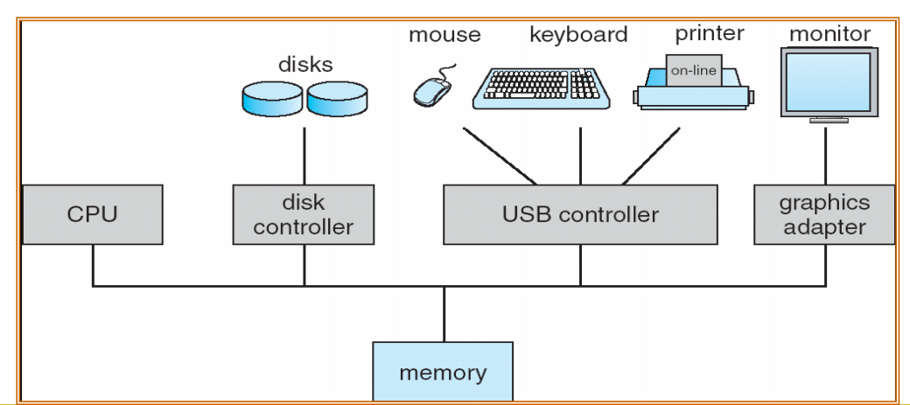

Created: 202412282023
Tags: 

## Hệ điều hành là gì?
- Là thành phần trung gian giữa người dùng và hệ thống phần cứng máy tính
- Mục đích:
	- Thực thi chương trình người dùng dễ dàng hơn
	- Sử dụng hệ thống máy tính thuận tiện hơn
	- Sử dụng hệ thống máy tính hiệu quả 
#### Các thành phần của 1 hệ thống máy tính

- Phần cứng: cung cấp các tài nguyên cơ bản (CPU, bộ nhớ, các thiết bị vào ra)
- Hệ điều hành: điều khiển và điều phối việc sử dụng phần cứng máy tính phục vụ các chương trình ứng dụng của người dùng.
- Các chuơng trình ứng dụng: Sử dụng các tài nguyên máy tính để giải quyết các vấn đề tính toán của người dùng
- Người dùng: Con người, máy móc hay các hệ thống máy tính khác
#### Quản lý tiến trình
- Một chương trình không làm gì trừ khi các chỉ thị của nó được thực thi bởi một CPU. 
- Một tiến trình có thể được xem như một chương trình đang thực thi. 
- Một tiến trình là một công việc hay chương trình chia thời
- Một tiến trình cần các tài nguyên xác định-gồm thời gian CPU, bộ nhớ, tập tin, các thiết bị xuất /nhập-để hoàn thành tác vụ của nó.
- Các tài nguyên này được cấp cho tiến trình khi nó được tạo ra, hay được cấp phát tới nó khi nó đang chạy. 
- Khi tiến trình này kết thúc, hệ điều hành sẽ đòi lại bất cứ tài nguyên nào có thể dùng lại. 
#### Định nghĩa hệ điều hành
- Bộ phân phối tài nguyên: Quản lý và điều phối tài nguyên
- Bộ điều khiển chương trình: Điều khiển thực thi chương trình của người dùng và điều khiển thao tác của các thiết bị vào ra
- Chương trình kernel (nhân): Chương trình luôn được thực thi khi hệ thống máy tính hoạt động
## Các hệ thống máy tính điển hình
#### Các hệ Mainframe
###### Các hệ xử lý theo lô đơn giản
- Có thể coi là hệ điều hành đầu tiên, tương đối đơn giản
- Nhiệm vụ của HĐH: truyền quyền điều khiển tuần tự cho các “công việc” (job) trong lô (batch)
- “Công việc”: chương trình, dữ liệu, các thông tin điều khiển…
- Nhược điểm: không tận dụng CPU một cách hiệu quả
- Phân phối bộ nhớ 
	
###### Các hệ xử lý theo lô, đa chương trình
- Vấn đề: Làm sao để giữ CPU luôn bận rộn?
- Cơ sở: Một chương trình người dùng không thể cùng một lúc sử dụng cả CPU và các thiết bị vào ra
- Phân phối bộ nhớ
	
- Tư tưởng chính:
	- Lưu đồng thời nhiều công việc trong bộ nhớ trong
	- Hệ điều hành chọn công việc để thực hiện
	- Trong trường hợp công việc đang phải đợi thực hiện một thao tác nào đó (ví dụ thao tác vào/ra) Hệ điều hành sẽ chọn việc khác để thực hiện
- Đặc điểm:
	- Tương đối phức tạp
	- Khái niệm “Nhóm công việc” (job pool)
	- Lập lịch công việc: chọn các công việc để chuyển vào bộ nhớ trong
	- Quản lý lưu trữ: lưu cùng lúc một số công việc trong bộ nhớ trong
	- Lập lịch CPU: chọn thực thi một trong các công việc đang ở bộ nhớ trong
###### Các hệ phân chia thời gian - Time sharing
- Các hệ xử lý theo lô, đa chương trình cung cấp một môi trường trong đó các tài nguyên hệ thống được sử dụng một cách hiệu quả, nhưng không cung cấp cho người dùng khả năng tương tác với hệ thống
	=> Các hệ phân chia thời gian là sự mở rộng của các hệ xử lý theo lô, đa chương trình
- Tư tưởng chính
	- Chuyển đổi quyền xử lý giữa các chương trình thường xuyên hơn
	- Thời gian phản ứng ~ 1 giây hoặc ít hơn
	- Cho phép chia sẻ đồng thời một máy tính giữa nhiều người dùng
	- Khái niệm “tiến trình”: chương trình được nạp vào bộ nhớ và đang được thực thi
	- Vào/ra tương tác -> phụ thuộc “people speech” ví dụ tốc độ nhập dữ liệu
- Đặc điểm:
	- Phức tạp hơn hệ xử lý theo lô, đa chương trình
	- Quản lý bộ nhớ và bảo vệ
	- Tráo đổi các công việc từ đĩa cứng và bộ nhớ (swap in/swap out) 
		-> phương pháp bộ nhớ ảo
	- Hệ thống file trên một số đĩa cứng -> quản lý đĩa cứng
	- Thực thi đồng thời -> Lập lịch CPU
	- Giao tiếp và đồng bộ hoá
	- Giải quyết bế tắc
- Quản lý bộ nhớ
	- Bộ nhớ chính là trung tâm điều hành của một máy tính hiện đại
	- Bộ nhớ chính là một kho chứa dữ liệu có khả năng truy xuất nhanh được chia sẻ bởi CPU và các thiết bị xuất /nhập
	- Hệ điều hành có nhiệm vụ cho các hoạt động sau khi đề cập tới việc quản lý bộ nhớ
		- Giữ vết về phần nào của bộ nhớ hiện đang được dùng và tiến trình nào đang dùng. 
		- Quyết định tiến trình nào được nạp vào bộ nhớ khi không gian bộ nhớ trở nên sẵn dùng. 
		- Cấp phát và thu hồi không gian bộ nhớ khi được yêu cầu
#### Các hệ máy tính cá nhân
- Xuất hiện những năm 1970
- Hướng tới sự tiện dụng của người dùng
- Các hệ điều hành cho máy tính cá nhân
	- Microsoft Windows, Apple Macintosh
	- Linux, Unix-like OS cho PCs
	- Kế thừa sự phát triển của hệ điều hành cho các hệ Mainframe
#### Các hệ song song, các hệ phân tán, các hệ thời gian thực
###### Các hệ song song
- Còn gọi là hệ đa xử lý (multiprocessor systems)
- Một hệ thống có nhiều bộ xử lý, giao tiếp “gần”, chia sẻ computer bus, clock...
- Ưu điểm:
	- Tăng thông lượng: làm được nhiều việc hơn trong một đơn vị thời gian
	- Hiệu quả kinh tế: Hệ song song tiết kiệm hơn nhiều hệ đơn vì có thể chia sẻ các thiết bị ngoại vi, thiết bị lưu trữ và nguồn
	- Tăng độ tin cậy: Một bộ xử lý gặp trục trặc không làm sụp đổ cả hệ thống
- Phân loại: Hai loại
	- Đa xử lý đối xứng (SMP): Mỗi bộ xử lý có một phiên bản sao chép hệ điều hành, giao tiếp với nhau peer-to-peer
	- Đa xử lý không đối xứng (AMP):
		- Mỗi bộ xử lý được gán một nhiệm vụ
		- Bộ xử lý chủ (master) sắp xếp công việc và quản lý các máy phục phục vụ (slave)
###### Các hệ phân tán
- Các hệ phân tán thực thi dựa trên hệ thống mạng
- Thông qua các giao thức mạng và trao đổi giữa các node, các hệ phân tán cho phép chia sẻ và cùng thực thi các nhiệm vụ tính toán.
- Các hệ phân tán:
	- Các hệ client-server
	- Các hệ peer-to-peer
###### Các hệ thời gian thực
- Các hệ thời gian thực có những ràng buộc về thời gian
	- Xử lý phải được thực hiện trong một thời gian xác định hoặc việc thực thi sẽ không có ý nghĩa
	- Ví dụ: các hệ điều khiển máy móc tự động, robot dò đường …
## Tổ chức hệ thống máy tính
#### Các thao tác trong hệ thống máy tính
- Một hệ thống máy tính gồm một hoặc nhiều CPU và một số bộ điều khiển thiết bị kết nối với nhau thông qua một bus chung, chia sẻ một bộ nhớ chung

- Các thao tác trong hệ thống máy tính
	- Khởi động (người dùng)
	- Chương trình mồi (thường nằm trong ROM hay EPROM)
		- Khởi tạo: thanh ghi CPU, các bộ điều khiển thiết bị, nội dung bộ nhớ
		- Tải hệ điều hành (chương trình mồi phải biết địa chỉ bắt đầu của hệ điều hành) vào bộ nhớ trong
		- Chuyển quyền thực thi cho hệ điều hành
- Hệ điều hành: Thực hiện tiến trình đầu tiên (init) và chờ đợi các “sự kiện” (các “ngắt” từ phần cứng/phần mềm)
- Các thiết bị vào ra và CPU có thể thực thi đồng thời; tương tranh các chu kì bộ nhớ
- Mỗi bộ điều khiển thiết bị (device controller) chịu trách nhiệm một loại thiết bị xác định
- Mỗi bộ điều khiển thiết bị có một bộ đệm
- CPU chuyển dữ liệu từ/vào bộ nhớ ra/từ các bộ đệm
- Thao tác vào ra (I/O) là các thao tác từ thiết bị đến bộ đệm của bộ điều khiển
- Các bộ điều khiển thiết bị báo cho CPU biết chúng đã hoàn thành các tác vụ của chúng bằng cách làm sinh ra một tín hiệu ngắt (interrupt)
#### Cấu trúc lưu trữ
- Bộ nhớ chính (RAM)
	- Vùng lưu trữ lớn duy nhất mà CPU có thể truy nhập trực tiếp
	- Tương tác giữa CPU và BNC thông qua một loạt các thao tác load/store
- Các thanh ghi
	- Thanh ghi lệnh
	- Các thanh ghi nội tại khác
- Thiết bị lưu trữ thứ cấp: Ví dụ: đĩa từ
- Cơ chế đọc đĩa
	
#### Phân cấp các thiết bị lưu trữ
- Các hệ thống lưu trữ được phân cấp theo các tiêu chí về.
	- Tốc độ
	- Giá thành
	- Tính không ổn định (Volatility)
- Phân cấp
	
- Từ đĩa từ đến thanh ghi
	
- Caching
	- sao chép thông tin vào thiết bị lưu trữ nhanh hơn
	- bộ nhớ chính có thể được xem là cache của bộ nhớ thứ cấp
	- Sử dụng bộ nhớ tốc độ cao để lưu trữ dữ liệu mới được truy cập
		-> Cần một chiến lược quản lý cache
	 - Caching làm nảy sinh một cấp độ mới trong phân cấp lưu trữ
		-> đảm bảo tính nhất quán của dữ liệu được lưu trữ cùng lúc ở nhiều nơi (với các cấp độ truy cập khác nhau
#### Cấu trúc vào/ra

- Các thiết bị lưu trữ chỉ là một loại thiết bị vào/ra
- Các bộ điều khiển thiết bị (device controller)
	- Có thể có nhiều hơn một thiết bị được gắn với 1 bộ điều khiển thiết bị (ví dụ: SCSI)
	- Mỗi bộ điều khiển thiết bị có một bộ đệm
	- Chịu trách nhiệm giữa các thiết bị ngoại vi và bộ đệm
- Trình điều khiển thiết bị (device driver)
	- Thường được cung cấp bởi Hệ điều hành
	- Tương ứng với mỗi bộ điều khiển thiết bị là một trình điều khiển thiết bị
	- Cung cấp một giao diện truy nhập đến thiết bị cho các thành phần khác của hệ điều hành.
## Các thao tác trong hệ điều hành
#### Hệ điều hành quản lý bởi ngắt
- Các nhiệm vụ của ngắt
	- Ngắt chuyển điều khiển đến dịch vụ ngắt, thông qua một vectoc ngắt – nơi chứa địa chỉ của tất cả các dịch vụ ngắt
	- Trong kiến trúc ngắt, ta phải lưu giữ địa chỉ của lệnh tại đó có tín hiệu ngắt ngắt -> cho việc khôi phục lại quá trình tính toán sau khi xử lý ngắt
	- Trong khi một ngắt đang được xử lý, các ngắt khác sẽ bị từ chối để tránh hiện tượng “lost interupt”
	- Một trap hay exception là một ngắt của chương trình người dùng, sinh ra do lỗi hoặc một yêu cầu đặc biệt của người dùng.
	- Hệ điều hành điều khiển bởi ngắt
- Xử lý ngắt
	- Hệ điều hành bảo quản trạng thái của CPU bằng cách lưu lại các thanh ghi, bộ đếm chương trình…
	- Xác định loại tín hiệu ngắt, gọi dịch vụ ngắt
		- Tìm kiếm tuần tự theo thông tin ngắt
		- Sử dụng vector ngắt
- Dịch vụ ngắt
	- Phân tích thông tin ngắt (interrupt information)
	- Gọi trình xử lý tín hiệu ngắt tương ứng
#### Cơ chế dual-mode (hai chế độ)

- Hỗ trợ phần cứng cho việc tách biệt ít nhất hai chế độ thao tác
- User mode – thực thi dưới tư cách người dùng.
- Monitor mode (còn gọi là kernel mode hay system mode) – thực thi dưới tư cách hệ điều hành.
- Bit mode được thêm vào phần cứng để chỉ mode hiện thời: monitor (0) or user (1).
- Khi có ngắt hoặc là phát sinh lỗi, phần cứng được chuyển qua monitor mode
#### Timer
- Timer được sử dụng để ngăn các tiến trình chiếm tài nguyên quá lâu
	- Sinh ra ngắt sau một đơn vị thời gian
	- Hệ điều hành sử dụng một biến đếm
		- Trừ dần biến đếm đi 1
		- Biến đếm bằng 0 ->sinh ngắt

## Question
- Mục đích của các lệnh gọi hệ thống là gì?
- Năm hoạt động chính của một hệ điều hành liên quan đến quản lý quy trình là gì?
- Ba hoạt động chính của một hệ điều hành liên quan đến quản lý bộ nhớ là gì ?
- Ba hoạt động chính của một hệ điều hành liên quan đến quản lý lưu trữ thứ cấp là gì ?
- Mục đích của thông dịch lệnh là gì? Tại sao nó thường tách từ hạt nhân?
- Lệnh gọi hệ thống nào phải được thực thi bởi một thông dịch lệnh hoặc trình tiện ích để bắt đầu một tiến trình mới?
- Mục đích của chương trình hệ thống là gì?
- Lợi thế và bất lợi của cách tiếp cận lớp để thiết kế hệ thống là gì? 
- Danh sách năm dịch vụ được cung cấp bởi một hệ điều hành. Các dịch vụ đã cung cấp sự tiện lợi cho người sử dụng ra sao? Cũng giải thích tại sao các chương trình ứng dụng mức người dùng không thể cung cấp dịch vụ này? 
- Mục đích của các lệnh gọi hệ thống là gì?
- Những ưu điểm chính của phương pháp microkernel để thiết kế hệ thống là gì?
- Tại sao một số các hệ thống lưu trữ hệ điều hành trong firmware, và số khác lại lưu trữ trên đĩa?
- Một hệ thống thiết kế cho phép lựa chọn hệ điều hành khi khởi động như thế nao? Chương trình bootstrap cần làm gì?

-----
## References
1.
