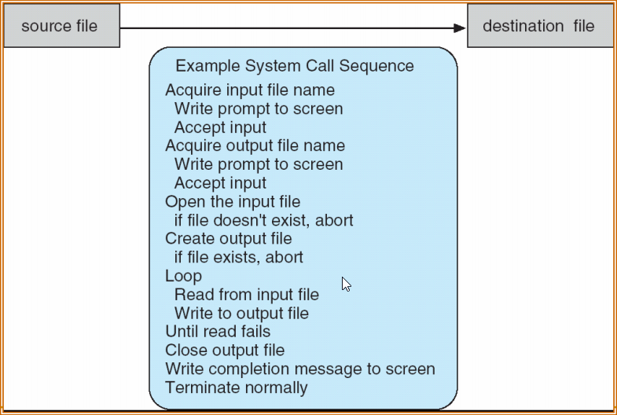
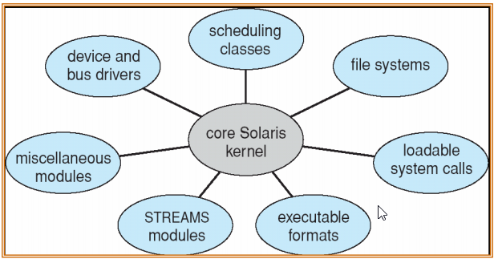

Created: 202412282109
Tags: 

## Các thành phần hệ thống
#### Quản lý tiến trình
- Một tiến trình là một chương trình đang thực thi.
- Một chương trình không làm gì trừ khi các chỉ thị của nó được thực thi bởi một CPU. 
- Một tiến trình là một công việc hay chương trình chia sẻ thời gian
- Một tiến trình cần các tài nguyên xác định gồm: thời gian CPU, bộ nhớ, tập tin, các thiết bị xuất /nhập để hoàn thành tác vụ của nó. 
- Các tài nguyên này được cấp cho tiến trình khi nó được tạo ra, hay được cấp phát tới nó khi nó đang chạy. 
- Khi tiến trình này kết thúc, hệ điều hành sẽ đòi lại bất cứ tài nguyên nào có thể dùng lại. 
- Một tiến trình là một đơn vị công việc trong hệ thống. Một hệ thống chứa tập các tiến trình, một vài tiến trình này là các tiến trình hệ điều hành (thực thi mã hệ thống) và các tiến trình còn lại là các tiến trình người dùng (chúng thực thi mã người dùng)
- Hệ điều hành có nhiệm vụ cho các hoạt động sau khi đề cập đến chức năng quản lý tiến trình: 
	- Tạo và xoá các tiến trình người dùng và hệ thống 
	- Tạm dừng và thực thi tiếp tiến trình 
	- Cung cấp các cơ chế đồng bộ hoá tiến trình 
	- Cung cấp các cơ chế giao tiếp tiến trình 
	- Cung cấp cơ chế quản lý bế tắc
#### Quản lý bộ nhớ
- Bộ nhớ chính là trung tâm điều hành của một máy tính hiện đại
- Bộ nhớ chính là một kho chứa dữ liệu có khả năng truy xuất nhanh được chia sẻ bởi CPU và các thiết bị xuất /nhập
- Hệ điều hành có nhiệm vụ cho các hoạt động sau khi đề cập tới việc quản lý bộ nhớ
	- Giữ vết về phần nào của bộ nhớ hiện đang được dùng và tiến trình nào đang dùng. 
	- Quyết định tiến trình nào được nạp vào bộ nhớ khi không gian bộ nhớ trở nên sẵn dùng. 
	- Cấp phát và thu hồi không gian bộ nhớ khi được yêu cầu
#### Quản lý lưu trữ
- Máy tính có thể lưu thông tin trên nhiều loại phương tiện lưu trữ vật lý khác nhau
- Mỗi phương tiện được điều khiển bởi một thiết bị, như một ổ đĩa hay ổ băng từ
- Các thuộc tính này bao gồm tốc độ truy xuất, dung lượng, tốc độ truyền dữ liệu và phương pháp truy xuất (tuần tự hay ngẫu nhiên)
- Hệ điều hành có nhiệm vụ thực hiện các hoạt động trong việc quản lý hệ thống tập tin: 
	- Tạo và xoá tập tin 
	- Tạo và xoá thư mục 
	- Hỗ trợ các hàm nguyên thuỷ để thao tác tập tin và thư mục 
	- Ánh xạ các tập tin trên các thiết bị lưu trữ phụ
	- Sao lưu dự phòng tập tin trên các phương tiện lưu trữ ổn định
#### Bảo vệ và bảo mật
- Nếu một hệ thống máy tính có nhiều người dùng và cho phép thực thi đồng thời  nhiều tiến trình, thì các tiến trình khác nhau phải được bảo vệ từ các hoạt động của tiến trình khác
- Các cơ chế đảm bảo rằng các tập tin, phân đoạn bộ nhớ, CPU, và các tài nguyên khác có thể được điều hành chỉ bởi các tiến trình có quyền phù hợp từ hệ điều hành
- Bảo vệ là một cơ chế để điều khiển truy xuất của các chương trình, tiến trình hay người dùng tới tài nguyên được định nghĩa bởi một hệ thống máy tính
- Bảo vệ có thể cải tiến khả năng tin cậy bằng cách phát hiện các lỗi tiềm tàng tại các giao diện giữa các hệ thống con thành phần
- Tài nguyên không được bảo vệ không thể ngăn chặn việc sử dụng bởi người dùng không có quyền 
## Các dịch vụ của hệ điều hành
- Một tập các dịch vụ hệ điều hành cung cấp các tính năng hữu ích cho người dùng
	- Giao diện người dùng: CLI, GUI, Batch
	- Thực thi chương trình: Hệ thống phải có khả năng tải chương trình người dùng vào bộ nhớ và thực thi chương trình, sau đó kết thúc việc thực thi (có lỗi hoặc thành công)
	- Các thao tác vào/ra – Một chương trình đang thực thi có thể có yêu cầu vào /ra như đọc một file hay một thiết bị vào /ra
	- Thực thi hệ thống tập tin– Cung cấp cách tổ chức tập tin, thư mục, các thao tác đọc /ghi /sửa /xóa /liệt kê
- Một tập các dịch vụ hệ điều hành cung cấp các tính năng hữu ích cho người dùng (cont.)
	- Giao tiếp–Các tiến trình (trên cùng một máy /trên một mạng) có thể trao đổi thông tin với nhau: Giao tiếp có thể thông qua sử dụng bộ nhớ chia sẻ hoặc truyền thông báo 
	- Sửa lỗi
		- Xác định được lỗi xuất hiện tại CPU hay bộ nhớ, trong thiết bị vào /ra hay trong chương trình người dùng
		- Với mỗi loại lỗi, Hệ điều hành (OS) lựa chọn một hoạt động thích hợp để đảm bảo việc tính toán đúng đắn và nhất quán.
		- Các tính năng gỡ lỗi
- Một số tính năng khác của OS cho phép thực thi hệ thống hiệu quả nhờ chia sẻ tài nguyên
	- Phân phối tài nguyên
	- Kế toán: cho biết người dùng nào sử dụng bao nhiêu và những loại tài nguyên hệ thống nào.
	- Bảo vệ và bảo mật: bảo vệ việc sử dụng thông tin trong các hệ thống đa người dùng, các hệ thống nối mạng; bảo vệ các tiến trình thực thi đồng thời
## Các lời gọi hệ thống
- Là giao diện lập trình đến các dịch vụ hệ thống được cung cấp bởi OS
- Thường được viết bằng ngôn ngữ bậc cao (C hay C++)
- Các chương trình thường truy nhập đến các lời gọi hệ thống thông qua giao diện chương trình ứng dụng (API) (không gọi trực tiếp các lời gọi hệ thống)
- Ví dụ: Win32 API, POSIX API, Java API
- Ví dụ về các lời gọi hệ thống: Chuỗi các lời gọi hệ thống cho việc sao chép nội dung từ một file sang file khác
	
- Ví dụ của một API chuẩn: Hàm Readfile trong Win32 API –hàm cho phép đọc từ một file
	

- Cài đặt lời gọi hệ thống
	- Các lời gọi hệ thống được liên kết với một số hiệu. Giao diện lời gọi hệ thống quản lý một bảng đánh chỉ số theo các số hiệu này
	- Giao diện lời gọi hệ thống tham chiếu đến lời gọi hệ thống mong muốn trong nhân OS và trả lại trạng thái của lời gọi hệ thống và các giá trị trả về nếu có
	- Chương trình không cần biết lời gọi hệ thống được thực thi thế nào
		- Chỉ cần gọi đúng API và hiểu OS sẽ làm gì với lời gọi đó
		- Hầu hết các chi tiết của OS được che dấu
- Mối quan hệ giữa API –lời gọi hệ thống và OS
	
- Ví dụ về thư viện C chuẩn
	

- Truyền tham số cho lời gọi hệ thống
	- Ba cách truyền tham số
		- Truyền qua thanh ghi
		- Các tham số được lưu trong khối (hay bảng) trong bộ nhớ và địa chỉ của khối được truyền cho thanh ghi: Được thực hiện bởi Linux và Solaris
		- Các tham số được chương trình người dùng đặt hoặc đẩy vào một ngăn xếp và sau đó được đọc ra bởi hệ điều hành
	- Các phương pháp thông qua khối hay ngăn xếp không giới hạn số lượng của các tham số được truyền

- Truyền tham số thông qua bảng
	

- Các kiểu lời gọi hệ thống
	- Quản lý tiến trình
	- Quản lý file
	- Quản lý thiết bị
	- Duy trì thông tin
	- Giao tiếp
## Các chương trình hệ thống
- Cung cấp một môi trường thuận tiện cho việc phát triển và thực thi chương trình
- Một số chương trình hệ thống là các giao diện người dùng đơn giản truy nhập đến các lời gọi hệ thống
- Quản lý file – create, delete, copy, rename, print, dump, list
- Thông tin trạng thái 
	- date, time, lượng bộ nhớ còn rỗi, không gian đĩa, số lượng người dùng
	- thông tin về performance, logging và debugging
	- Thông thường, các chương trình này in kết quả ra màn hình hoặc các thiết bị ra khác
	- Một số hệ thống thực thi registry –được sử dụng để lưu và nhận các thông tin cấu hình
- Soạn thảo file
	- Trình tạo và soạn thảo file
	- Các lệnh cho phép tìm kiếm và định dạng text
- Hỗ trợ chương trình người dùng – compilers, assemblers, debuggers và intepreters
- Giao tiếp: Web browser, gửi thông điệp giữa các máy, gửi thư điện tử, remote access, truyền file
## Cấu trúc hệ điều hành
- Cấu trúc nội tại của các hệ điều hành khác nhau có thể khác nhau đáng kể
- Việc thiết kế có thể bắt đầu từ mục tiêu người dùng và các đặc tả
- Mục tiêu người dùng và mục tiêu hệ thống
	- Mục tiêu người dùng: hệ điều hành phải dễ dùng, dễ học, tin cậy, an toàn và nhanh
	- Mục tiêu hệ thống: OS phải dễ dàng thiết kế, cài đặt, bảo trì, hiệu quả, kháng lỗi, linh hoạt, đáng tin cậy
#### Cấu trúc đơn giản
- MS-DOS – được viết để cung cấp hầu hết các tính năng và dung lượng bé nhất có thể
	- Không được chia thành các module
	- Dù MS-DOS cũng có cấu trúc, giao diện và các tính năng của nó không được phân chia tốt lắm
- Cấu trúc hệ điều hành MS-DOS
	
#### Cấu trúc phân tầng

- OS được chia thành một số tầng (level) – tầng thấp nhất là phần cứng, tầng cao nhất là giao diện người dùng

- UNIX OS có hai phần tách biệt
	
	- Các chương trình hệ thống
	- Nhân
		- Bao gồm mọi thứ dưới giao diện lời gọi hệ thống và trên phần cứng vật lý
		- Cung cấp hệ thống file, lập lịch CPU, quản lý bộ nhớ, và các tính năng khác của OS
#### Cấu trúc vi nhân
- Giao tiếp giữa các module người dùng sử dụng truyền thông báo
- Lợi ích
	- Dễ dàng mở rộng vi nhân
	- Dễ dàng chuyển OS sang kiến trúc mới
	- Tin cậy hơn (ít mã được thực thi trong nhân)
	- An toàn hơn
- Nhược: Tốn tài nguyên cho giao tiếp giữa không gian người dùng và không gian nhân

- Cấu trúc của Mac OS X
	
#### Module hóa
- Hầu hết các OS hiện đại thực hiện module hóa nhân
	- Hướng tiếp cận hướng đối tượng
	- Các thành phần nhân tách biệt
	- Các thành phần giao tiếp thông qua giao diện.
	- Mỗi thành phần có thể được tải theo yêu cầu

- Cấu trúc của Solaris
	

## Question
- Mục đích của các lệnh gọi hệ thống là gì?
- Năm hoạt động chính của một hệ điều hành liên quan đến quản lý quy trình là gì?
- Ba hoạt động chính của một hệ điều hành liên quan đến quản lý bộ nhớ là gì ?
- Ba hoạt động chính của một hệ điều hành liên quan đến quản lý lưu trữ thứ cấp là gì ?
- Mục đích của thông dịch lệnh là gì? Tại sao nó thường tách từ hạt nhân?
- Lệnh gọi hệ thống nào phải được thực thi bởi một thông dịch lệnh hoặc trình tiện ích để bắt đầu một tiến trình mới?
- Mục đích của chương trình hệ thống là gì?
- Danh sách năm dịch vụ được cung cấp bởi một hệ điều hành. Các dịch vụ đã cung cấp sự tiện lợi cho người sử dụng ra sao? Cũng giải thích tại sao các chương trình ứng dụng mức người dùng không thể cung cấp dịch vụ này? 
- Mục đích của các lệnh gọi hệ thống là gì?
- Những ưu điểm chính của phương pháp microkernel để thiết kế hệ thống là gì?
- Tại sao một số các hệ thống lưu trữ hệ điều hành trong firmware, và số khác lại lưu trữ trên đĩa?
- Một hệ thống thiết kế cho phép lựa chọn hệ điều hành khi khởi động như thế nao? Chương trình bootstrap cần làm gì?

-----
## References
1.
