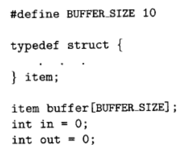

Created: 202412282221
Tags: 

## Khái niệm về tiến trình
- Một hệ điều hành thực hiện nhiều chương trình
	- Hệ thống xử lý theo lô: công việc (job)
	- Hệ thống chia sẻ thời gian: tác vụ (task)
- Dùng tiến trình và công việc với cùng ý nghĩa
- Chương trình đang được thực hiện, bao gồm
	- Phần văn bản
	- Ngăn xếp
	- Phần dữ liệu
	- Giá trị bộ đếm chương trình, thanh ghi
- CPU xử lý tiến trình tuần tự
- Là thực thể hoạt động, đối lập với chương trình
- Cấu trúc bộ nhớ tiến trình
	
- Trạng thái tiến trình
	
	- Tiến trình thay đổi trạng thái trong khi thựchiện
		- New
		- Ready
		- Running
		- Waiting
		- Terminated
	- Tại một thời điểm chỉ có một tiến trình ở trạng thái running
- Khối điều khiển tiến trình (PCB)
	
- Chuyển đổi CPU giữa các tiến trình
	
## Lập lịch tiến trình
- Mục đích của đa chương trình: Tăng tính tận dụng CPU
- Mục đích của phân chia thời gian: Người dùng có thể tương tác với tiến trình trong lúc nó đang thực thi
-> Xử lý nhiều tiến trình
-> Lập lịch tiến trình

- Các hàng đợi lập lịch tiến trình
	- Hàng đợi công việc: Một tập các tiến trình trong hệ thống
	- Hàng đợi sẵn sàng: Tập các tiến trình trong bộ nhớ trong, sẵn sàng và chỉ chờ thực hiện
	- Hàng đợi thiết bị: Tập các tiến trình chờ một thiết bị vào /ra
	- Các tiến trình di trú từ hàng đợi này đến hàng đợi khác
- Hàng đợi sẵn sàng và các hàng đợi thiết bị khác nhau
	
- Biểu diễn việc lập lịch tiến trình-Biểu đồ hàng đợi
	

- Vòng đời của một tiến trình
	- Khởi tạo: hàng đợi sẵn sàng
	- Các sự kiện có thể xảy ra khi tiến trình đã được gán CPU
		- Sinh ra một yêu cầu I/O, đi vào hàng đợi I/O
		- Tạo ra một tiến trình con và đợi cho nó kết thúc
		- Bị tước quyền sử dụng CPU
	- Tiếp tục vòng lặp đến khi kết thúc
		- Bị xóa khỏi tất cả các hàng đợi
		- PCB và tất cả các tài nguyên bị thu hồi
- Các bộ lập lịch
	- Tiến trình lưu trú trong nhiều loại hàng đợi: Các bộ lập lịch chọn các tiến trình từ các hàng đợi
	- Bộ lập lịch dài hạn
		- Lập lịch công việc – job scheduler
		- Chọn các tiến trình trong tập tiến trình và tải nó vào bộ nhớ để thực hiện.
		- Hai loại tiến trình:
			- Giới hạn I/O 
			- Giới hạn CPU
		- Chọn một kết hợp tốt các tiến trình giới hạn vào /ra và các tiến trình giới hạn CPU.
		- Một số hệ thống phân chia thời gian không có bộ lập lịch dài hạn (Unix) 
	- Bộ lập lịch ngắn hạn (lập lịch CPU): Chọn trong số các tiến trình trong hàng đợi sẵn sàng để thực hiện

|                 | Bộ lập lịch ngắn hạn                   | Bộ lập lịch dài hạn                                          |
| --------------- | -------------------------------------- | ------------------------------------------------------------ |
| Tần số thực thi | Thường xuyên<br>Đòi hỏi thực thi nhanh | Không thường xuyên bằng<br>Thể hiện mức độ “đa chương trình” |

- Bộ lập lịch trung hạn: Sử dụng trong một số HĐH phân chia thời gian
	

- Chuyển đổi ngữ cảnh
	- Chuyển đổi CPU cho một tiến trình khác
	- Ngữ cảnh tiến trình
	- Hoạt động chuyển đổi ngữ cảnh
	- Kernel lưu lại ngữ cảnh của tiến trình cũ trong PCB và tải ngữ cảnh được lưu của tiến trình mới được lập lịch
	- Thời gian chuyển đổi ngữ cảnh: lãng phí
		- Phụ thuộc vào máy, thông thường từ 1 đến 1000 micro giây
		- Phụ thuộc vào sự hỗ trợ của phần cứng
		- Các kĩ thuật quản lý bộ nhớ
		- Bottleneck sử dụng các cấu trúc mới như thread để tránh nút cổ chai này
## Các thao tác trên tiến trình
#### Tạo tiến trình
- Một tiến trình có thể tạo ra nhiều tiến trình con, qua lời gọi hệ thống create_process
	- Tiến trình cha
	- Tiến trình con
- Cây tiến trình
	
- Chia sẻ tài nguyên
	- Tất cả các tài nguyên
	- Một phần tài nguyên
	- Cũng có thể không chia sẻ tài nguyên
- Thực thi
	- Thực thi đồng thời
	- Thực thi  tuần tự
- Tạo tiến trình trong Unix
	- Mỗi tiến trình có một ID (PID)
	- Gọi lời gọi hệ thống fork() để tạo tiến trình mới
	- Tiến trình cha có thể đợi hoặc thực hiện đồng thời với tiến trình con
	- Không gian địa chỉ của tiến trình con là một bản sao của không gian địa chỉ tiến trình cha
	- Mã trả về từ fork()
	- Tiến trình con có thể gọi lời gọi hệ thống execlp() để tải một chương trình mới vào thực hiện
	- Fork() example
	
#### Hủy tiến trình
- Tiến trình thực thi xong
	- Hệ điều hành thực hiện lệnh exit
	- (có thể) trả về dữ liệu cho tiến trình cha
	- Hủy các tài nguyên đã được phân phối cho tiến trình
- Tiến trình bị hủy bởi một tiến trình khác (tiến trình cha). Tiến trình cha cần biết chỉ số của tiến trình con
- Tiến trình cha dừng sự hoạt động của tiến trình con vì
	- Tiến trình con dùng quá tài nguyên cho phép
	- Nhiệm vụ của tiến trình con không còn quan trọng
	- Tiến trình cha thoát và Hệ điều hành thực thi cơ chế “hủy theo dây chuyền” (cascading termination)
- Không thực hiện cơ chế hủy theo dây chuyền, tiến trình init trở thành tiến trình cha
## Hợp tác giữa các tiến trình
- Các tiến trình cộng tác
	- Tiến trình độc lập
		- Không bị ảnh hưởng bởi tiến trình khác
		- Không chia sẻ dữ liệu
	- Tiến trình hợp tác
		- Bị ảnh hưởng bởi tiến trình khác
		- Dùng chung dữ liệu
- Cần các kĩ thuật giao tiếp/ đồng bộ tiến trình
#### Vì sao hợp tác tiến trình?
- Chia sẻ thông tin. Đồng thời truy cập đến tài nguyên chia sẻ
- Tăng tốc độ tính toán
	- Chia thành các bài toán con, thực thi song song
	- Chỉ có được trong các hệ thống có nhiều thành phần xử lý (đa CPU, đa kênh vào /ra)
- Tính module hóa: Chia nhỏ các chức năng
- Tiện dụng: Có thể thực hiện nhiều nhiệm vụ tại một thời điểm
#### Bài toán “Producer - Consumer”
- Nhà sản xuất (producer): Sinh sản phẩm (thông tin/hàng hoá)
- Người tiêu dùng (consumer): Dùng thông tin/hàng hoá do Nhà sản xuất tạo ra
- Bộ đệm chung
	- Không giới hạn
	- Giới hạn
	- Hỗ trợ bởi hệ điều hành (thông qua IPC- Inter Process Communication)
	- Do lập trình viên tạo ra bằng cách sử dụng bộ nhớ chia sẻ

| Các biến dùng chung                                      | Mã lệnh cho Producer              | Mã lệnh cho Consumer              |
| -------------------------------------------------------- | --------------------------------- | --------------------------------- |
|  |  |  |
#### Truyền thông giữa các tiến trình
- Các tiến trình có thể giao tiếp thông qua tính năng truyền thông giữa các tiến trình (IPC) của HĐH
- IPC cho phép các tiến trình sử dụng không gian địa chỉ để giao tiếp và đồng bộ
- Hệ thống truyền thông báo
	- Giao tiếp giữa các tiến trình người dùng không cần chia sẻ dữ liệu mà thông qua việc truyền thông báo
	- Hai thao tác chính
		- Gửi
		- Nhận
	- Thông báo
		- Kích thước cố định
		- Kích thước thay đổi
	- Hai tiến trình P & Q truyền thông bằng cách gửi và nhận thông báo 
		-> Tạo thành một kết nối truyền thông
	- Các phương pháp để thiết lập liên kết và các thao tác gửi /nhận
		- Truyền thông trực tiếp/ gián tiếp
		- Truyền thông đối xứng/ bất đối xứng
		- Gửi bản sao hay gửi tham chiếu
		- Các thông điệp kích thước cố định hoặc thay đổi
- Định danh: Các tiến trình muốn giao tiếp với nhau cần có một cách thức để tham chiếu đến nhau!
- Truyền thông trực tiếp
	- Phải khai báo tên của người nhận/ gửi trong khi giao tiếp
		- send (P, message)
		- receive (Q, message)
	- Tính chất
		- Tự động thiết lập liên kết khi cần giao tiếp
		- Mỗi liên kết có đúng hai tiến trình
		- Có đúng một liên kết giữa bất kì 2 cặp tiến trình
	- Hệ thống vừa xét: đối xứng địa chỉ
	- Hệ thống bất đối xứng địa chỉ
		- Chỉ có người gửi định danh người nhận
		- Người nhận không cần định danh người gửi
			- Send(P, message)
			- Receive(id, message)
	- Thay đổi tên một tiến trình duyệt lại toàn bộ các tiến trình
- Truyền thông gián tiếp
	- Gửi và nhận thông qua hòm thư hoặc cổng
	- Mỗi hòm thư có một số định danh
	- Các thao tác gửi/ nhận
		- Send(A, message) – A là hòm thư
		- Receive(A, message) – nhận một thông báo từ hòm thư A
	- Tính chất
		- Một liên kết được thiết lập giữa hai tiến trình chỉ khi cả hai là thành viên của một hòm thư
		- Một liên kết có thể có nhiều hơn hai tiến trình
		- Giữa hai tiến trình có thể có nhiều liên kết
- Đồng bộ hóa
	- Truyền thông báo có thể là phong tỏa hay không phong tỏa (đồng bộ hoặc không đồng bộ)
		- Phong tỏa gửi
		- Không phong tỏa gửi
		- Phong tỏa nhận
		- Không phong tỏa nhận
- Lưu trữ bộ đệm: Hàng đợi tạm: các cách thiết kế
	- Zero capacity
	- Bounded capacity
	- Unbounded capacity
## Luồng - Thread
- Tại sao đa luồng?
	- Trình duyệt Web
		- Luồng hiển thị ảnh hoặc văn bản
		- Luồng nhận dữ liệu từ mạng
	- Trình word
		- Luồng hiển thị văn bản
		- Luồng đọc kí tự từ người dùng
		- Luồng thực hiện kiểm tra ngữ pháp và chính tả ngầm
- Tiến trình đơn luồng và tiến trình đa luồng
	
- Tại sao đa luồng?
	- Một ứng dụng đơn cần thực hiện một số nhiệm vụ tương tự đồng thời
		Ví dụ: Máy chủ web
	- Giải pháp đa tiến trình trước đây
		- Nặng nề hơn
		- Lãng phí do các tiến trình cùng thực hiện một số nhiệm vụ tương tự
- Lợi ích
	- Tính đáp ứng
	- Chia sẻ tài nguyên
	- Kinh tế
	- Phân phối tài nguyên và bộ nhớ cho tiến trình tốn kém
	- Tận dụng các kiến trúc đa xử lý
- Luồng mức người dùng (User - Thread)
	- Quản lý luồng được thực hiện bởi thư viện luồng ở mức người dùng
	- Examples
		POSIX Pthreads
		Mach C-threads
		Solaris threads
- Luồng mức nhân
	- Hỗ trợ trực tiếp bởi hệ điều hành
	- Ví dụ:
		Windows 95/98/NT/2000/7/8/10/2003/2012/2019
		Solaris
		Tru64 UNIX
		BeOS
		Linux

-  Các mô hình đa luồng

|        Many-to-One        |        One-to-One        |        Many-to-Many        |
| :-----------------------: | :----------------------: | :------------------------: |
|  |  |  |

- Pthreads
	
	- Chuẩn Posix (IEEE 1003.1c), API cho việc tạo và đồng bộ tiến trình
	- API xác định giao diện của thư viện,thực thi tùy thuộc vào cài đặt thư viện.
	- Phổ biến trong dòng hệ điều hành Unix.
## Lập lịch CPU
#### Các khái niệm cơ bản
- Tận dụng tối đa CPU trong đa chương trình
- Chu kỳ của các CPU-I/O burst – Việc thực thi tiến trình là một chu kì của các thực thi bởi CPU và chờ đợi vào ra
- Phân phối CPU burst
- Luân phiên giữa các CPU và I/O burst
	
- Biểu đồ tần suất của các CPU burst theo thời gian
	

- Bộ lập lịch CPU
	- Chọn trong số các tiến trình trong bộ nhớ trong và ở trạng thái ready để thực hiện (trao quyền sử dụng CPU cho tiến trình đó)
	- Việc lập lịch có thể được thực hiện trong một số trường hợp
		1. Tiến trình trạng thái running chuyển sang waiting
		2. Tiến trình trạng thái running chuyển sang trạng thái ready
		3. Có một tiến trình ở trạng thái waiting chuyển sang trạng thái ready
		4. Tiến trình hiện tại kết thúc thực thi
	- Lập lịch trong chỉ trong các trường hợp 1 và 4 gọi là lập lịch không chiếm đoạt (hay còn gọi là cộng tác)
	- Các trường hợp còn lại gọi là lập lịch chiếm đoạt

- Bộ điều vận
	- Bộ điều vận có nhiệm vụ chuyển điều khiển CPU cho tiến trình được lựa chọn bởi bộ lập lịch ngắn hạn
	- Chức năng của bộ điều vận bao gồm
		- Chuyển đổi ngữ cảnh
		- Chuyển sang user mode
		- Chuyển điều khiển đến một vị trí xác định trong chương trình người dùng để khởi động lại chương trình
	- Độ trễ điều vận: Thời gian dừng một tiến trình để bắt đầu thực thi tiến trình khác
#### Điều kiện lập lịch
- Tính tận dụng CPU: Thông thường từ 40-90%
- Thông lượng
- Thời gian quay vòng (turnaround time) 
- Thời gian chờ
- Thời gian phản ứng

- Vấn đề tối ưu các điều kiện
	- Cực đại hóa tính tận dụng CPU
	- Cực đại hóa thông lượng
	- Cực tiểu hóa thời gian quay vòng
	- Cực tiểu hóa thời gian đợi
	- Cực tiểu hóa thời gian phản ứng
#### Các thuật toán lập lịch
###### Đến trước–Phục vụ trước (FCFS)


- Nếu các tiến trình đến theo thứ tự P2, P3, P1
- Biểu đồ Gantt cho lập lịch
	
- Thời gian chờ của P1 = 6; P2 = 0; P3 = 3
- Thời gian chờ trung bình: (6 + 0 + 3)/3 = 3
- Tốt hơn nhiều so với trường hợp trên
- Convoy effect (hiệu quả hộ vệ)
###### Công việc ngắn nhất trước (SJF-Shortest Job First)
- Liên kết mỗi tiến trình với độ dài của “CPU burst” tiếp theo. Sử dụng độ dài này để lập lịch tiến trình với thời gian ngắn nhất.
- Hai dạng
	- Không chiếm đoạt–Một khi CPU đã được gán cho tiến trình, CPU không thể bị chiếm đoạt bởi một tiến trình nào khác (Non-preemptive).
	- Chiếm đoạt–Nếu một tiến trình mới đến với độ dài CPU burst nhỏ hơn thời gian thực thi còn lại của tiến trình sở hữu CPU, tiến trình mới được chiếm hữu CPU – Dạng “Thời gian còn lại ngắn nhất trước” (SRN) (Preemptive)
- SJF tối ưu thời gian chờ

- SJF không chiếm đoạt (SJN-Shortest Job Next)
	
- SJF chiếm đoạt (SRN-Shortest Remaining Next)
	
###### Lập lịch với độ ưu tiên
- Mỗi tiến trình liên kết với một độ ưu tiên (số nguyên) xác định
- CPU được phân phối cho tiến trình với độ ưu tiên cao nhất (giá trị độ ưu tiên nhỏ nhất)
	- Chiếm đoạt (preemptive)
	- Không chiếm đoạt (non preemptive)
- SJF là lập lịch với độ ưu tiên trong đó độ ưu tiên chính là khoảng CPU burst tiếp theo
- Vấn đề: “Chết đói” – Những tiến trình với độ ưu tiên thấp có thể sẽ không bao giờ được gán CPU
	-> Giải pháp: các tiến trình tăng độ ưu tiên theo thời gian
###### Lập lịch Round-Robin (RR)
- Mỗi tiến trình được gán một lượng tử thời gian Q (Quantum) (thường từ 10 – 100 mili giây)
- Hết lượng tử thời gian, tiến trình hiện tại bị tước CPU và đặt vào hàng đợi sẵn sàng
- Hiệu năng
	- FIFO
	- Q phải đủ lớn so với thời gian chuyển giao ngữ cảnh
- Vídụ: RR với lượng tử thời gian = 20
	- Biểu đồ Gantt
	
	
	
	```
	Thời gian chờ = Thời gian kết thúc - Thời gian đến - Thời gian chạy
	Vậy  P1 = 134 - 0 - 53   =   81
         P2 =  37 - 0 - 17   =   20
         P3 = 162 - 0 - 68   =   94
         P4 = 121 - 0 - 24   =   97
	Thời gian chờ trung bình = 292/4 = 73

	Thời gian lưu = Thời gian chờ + Thời gian chạy
	Vậy  P1 =  81 + 53 =   134
         P2 =  20 + 17 =    37
         P3 =  97 + 68 =   145
         P4 =  97 + 24 =   101  
	Thời gian lưu trung bình = 417/4 = 104,25
	
	RR tuy có thời gian quay vòng trung bình cao hơn FCFS và SJF nhưng có tính phản ứng tốt hơn
	```

- Thời gian lượng tử và thời gian chuyển đổi ngữ cảnh
	
- Biến đổi thời gian quay vòng theo thời gian lượng tử
	

###### Lập lịch với hàng đợi nhiều mức (Multi Level Queue)

- Sử dụng nhiều hơn một hàng đợi sẵn sàng
	Ví dụ: hàng đợi nền trước (foreground queue) cho các chương trình tương tác, hàng đợi nền sau (background) cho các chương trình duy trì hệ thống, các chương trình theo lô
- Sử dụng các thuật toán lập lịch khác nhau cho các hàng đợi
	Ví dụ: RR cho hàng đợi nền trước, FCFS cho hàng đợi nền sau
- Chia thời gian cho các hàng đợi
	Ví dụ: 80% thời gian cho hàng đợi nền trước, 20% cho nền sau

###### Hàng đợi nhiều mức phản hồi (MFQ)
- Không cố định tiến trình trên một hàng đợi 
- Ví dụ: các hàng đợi với các độ ưu tiên khác nhau
	- Các tiến trình gắn với Vào/ Ra ở hàng đợi có độ ưu tiên cao
	- Chuyển các tiến trình sử dụng CPU đến các hàng đợi có độ ưu tiên thấp
	- Chuyển các tiến trình phải đợi lâu đều đặn lên phía trên
###### Lập lịch các luồng trong Java
- JVM sử dụng thuật toán Preemptive, và dựa trên độ ưu tiên trong lập lịch
- Hàng đợi FIFO được sử dụng nếu có nhiều luồng cùng mức ưu tiên
- JVM lập lịch khi:
	1. Tiến trình đang chạy ra khỏi trạng thái runnable
	2. Một tiến trình có độ ưu tiên cao hơn vào trạng thái runnable
	
- Time-Slicing
	- Do JVM không hỗ trợ lát cắt thời gian (Time-Slicing), hàm `yield()` có thể được sử dụng:
		```
		while (true) {
			// perform CPU-intensive task
			. . .
			Thread.yield();
		}
		 
		Thread.yield() chuyển điều khiển cho luồng khác
		```

## Question
- Palm OS không cung cấp phương tiện để xử lý đồng thời. Thảo luận về ba vấn đề cơ bản mà tiến trình đồng thời thêm vào hệ điều hành
- Bộ xử lý Sun UltraSPARC có nhiều bộ thanh ghi. Mô tả hành động của một chuyển đổi ngữ cảnh khi ngữ cảnh mới được tải vào một trong các bộ thanh ghi rồi. Điều gì khác sẽ xảy ra  nếu ngữ cảnh ở trong bộ nhớ và mội thanh ghi đều bận
- Khi một tiến trình tạo ra một tiến trình mới bằng cách sử dụng hoạt động fork (), trạng thái nào sau đây được chia sẻ giữa tiến trình cha và tiến trình con?
	a. Stack
	b. Heap
	c. Shared memory segments
- Trong cơ chế RPC, hãy xem xét ngữ nghĩa "đúng một lần". Liệu các thuật toán để thực hiện ngữ nghĩa này thực hiện đúng ngay cả khi tin "ACK" nhắn lại cho khách hàng bị mất do lỗi mạng? Mô tả trình tự của thông điệp và khi nào "đúng một lần» được duy trì
- Giả sử một hệ thống phân tán thường hay bị lỗi của máy chủ. Cơ chế nào sẽ được yêu cầu để đảm bảo ngữ nghĩa "đúng một lần" cho việc thực hiện RPCs?


### 1. **Khái niệm về tiến trình**

- **Định nghĩa**: Tiến trình là một chương trình đang được thực hiện, bao gồm:
    - Phần văn bản (text section).
    - Ngăn xếp (stack).
    - Phần dữ liệu (data section).
    - Giá trị bộ đếm chương trình, thanh ghi.
- **Đặc điểm**: Tiến trình là thực thể hoạt động, khác với chương trình là thực thể không hoạt động. CPU xử lý tiến trình tuần tự.
- **Thuật ngữ**: Trong hệ điều hành, "tiến trình" và "công việc" (job) hoặc "tác vụ" (task) được sử dụng với cùng ý nghĩa, tùy theo hệ thống (hệ thống xử lý theo lô hoặc chia sẻ thời gian).

### 2. **Cấu trúc của tiến trình**

- Gồm các thành phần chính:
    - **Text Section**: Phần mã lệnh.
    - **Data Section**: Phần dữ liệu.
    - **Execution**: Quá trình thực thi.
    - **Stack**: Ngăn xếp để lưu trữ trạng thái thực thi.

### 3. **Trạng thái của tiến trình**

- Các trạng thái bao gồm:
    - **New**: Tiến trình mới được tạo.
    - **Admitted**: Được chấp nhận vào hệ thống.
    - **Ready**: Sẵn sàng để chạy, chờ CPU.
    - **Running**: Đang chạy trên CPU.
    - **I/O or Event Completion**: Chờ hoàn tất I/O hoặc sự kiện.
    - **Scheduled Dispatch**: Được lập lịch để thực thi.
    - **Interrupt**: Bị gián đoạn.
    - **Exit/Terminated**: Kết thúc hoặc bị hủy.

### 4. **Khối điều khiển tiến trình (PCB)**

- PCB lưu trữ thông tin mô tả tiến trình, bao gồm:
    - Con trỏ (pointer).
    - Số hiệu tiến trình (process number).
    - Bộ đếm chương trình (program counter).
    - Thanh ghi (registers).
    - Giới hạn bộ nhớ (memory limits).
    - Danh sách tệp mở (list of open files).

### 5. **Lập lịch tiến trình**

- **Mục đích**:
    - Đa chương trình: Tăng hiệu suất CPU.
    - Phân chia thời gian: Người dùng có thể tương tác với tiến trình trong lúc nó chạy.
- **Các loại hàng đợi**:
    - **Hàng đợi công việc**: Tập hợp các tiến trình trong hệ thống.
    - **Hàng đợi sẵn sàng**: Các tiến trình trong bộ nhớ, sẵn sàng chờ thực hiện.
    - **Hàng đợi thiết bị**: Các tiến trình chờ thiết bị I/O.
- **Vòng đời của tiến trình**:
    - Khởi tạo → Hàng đợi sẵn sàng.
    - Có thể yêu cầu I/O → Hàng đợi I/O.
    - Tạo tiến trình con → Chờ kết thúc.
    - Bị gián đoạn → Tiếp tục vòng lặp.
    - Kết thúc → Xóa khỏi hàng đợi, thu hồi tài nguyên.
- **Các bộ lập lịch**:
    - **Bộ lập lịch dài hạn (Job Scheduler)**: Chọn tiến trình từ tập hợp và nạp vào bộ nhớ.
    - **Bộ lập lịch ngắn hạn (CPU Scheduler)**: Chọn tiến trình từ hàng đợi sẵn sàng để thực thi.
    - **Bộ lập lịch trung hạn**: Quản lý tạm ngưng hoặc khôi phục tiến trình (dùng trong một số hệ thống phân chia thời gian).

### 6. **Chuyển đổi ngữ cảnh**

- **Quy trình**: Kernel lưu ngữ cảnh tiến trình cũ vào PCB và tải ngữ cảnh mới của tiến trình được lập lịch.
- **Thời gian chuyển đổi**: Phụ thuộc vào máy (1-1000 micro giây) và hỗ trợ phần cứng, gây lãng phí (bottleneck). Giải pháp: Sử dụng đa luồng (multi-threading).

### 7. **Các thao tác trên tiến trình**

- **Tạo tiến trình**:
    - Tiến trình cha tạo tiến trình con qua lời gọi hệ thống create process hoặc fork() (Unix).
    - Có thể chia sẻ hoặc không chia sẻ tài nguyên (toàn bộ, một phần, hoặc không).
    - Thực thi đồng thời hoặc tuần tự.
    - Ví dụ: fork() trong Unix tạo tiến trình con với PID riêng, có thể gọi exec() để tải chương trình mới.
- **Hủy tiến trình**:
    - Tiến trình tự hủy (thực thi lệnh exit).
    - Tiến trình cha hủy tiến trình con (do vượt tài nguyên hoặc nhiệm vụ không còn quan trọng).
    - Hiện tượng "chuyển hủy lan truyền" (cascading termination) khi tiến trình cha thoát, tiến trình init trở thành cha.

### 8. **Hợp tác giữa các tiến trình**

- **Tiến trình độc lập**: Không ảnh hưởng lẫn nhau, không chia sẻ dữ liệu.
- **Tiến trình hợp tác**: Ảnh hưởng lẫn nhau, chia sẻ dữ liệu, sử dụng kỹ thuật giao tiếp (IPC).
- **Lý do hợp tác**:
    - Chia sẻ thông tin.
    - Truy cập đồng thời tài nguyên.
    - Tăng tốc độ tính toán.
    - Tính mô-đun hóa.
- **Bài toán Producer-Consumer**:
    - Nhà sản xuất tạo sản phẩm, người tiêu dùng sử dụng.
    - Sử dụng bộ đệm chung (không giới hạn/bị giới hạn).
    - Hỗ trợ qua IPC hoặc bộ nhớ chia sẻ.

### 9. **Truyền thông giữa các tiến trình (IPC)**

- **Phương thức**:
    - Truyền thông trực tiếp: Gửi/nhận qua tên người nhận/gửi (send(P, message), receive(Q, message)).
    - Truyền thông gián tiếp: Qua hộp thư hoặc cổng (send(A, message), receive(A, message)).
- **Tính chất**:
    - Trực tiếp: Tự động lập liên kết, mỗi liên kết hai tiến trình.
    - Gián tiếp: Liên kết khi cả hai là thành viên hộp thư, có thể nhiều hơn hai tiến trình.
- **Loại thông báo**: Kích thước cố định/thay đổi, gửi bản sao hoặc tham chiếu.

### 10. **Luồng (Thread)**

- **Lý do sử dụng đa luồng**:
    - Thực hiện nhiều nhiệm vụ đồng thời (ví dụ: trình duyệt web, Word).
    - Giải pháp thay thế đa tiến trình (nhẹ hơn, giảm lãng phí).
- **Lợi ích**:
    - Tính đáp ứng.
    - Chia sẻ tài nguyên.
    - Kinh tế.
    - Tận dụng kiến trúc đa xử lý.
- **Loại luồng**:
    - **Luồng người dùng (User Thread)**: Quản lý bởi thư viện (POSIX Pthreads, Mach C-threads).
    - **Luồng nhân (Kernel Thread)**: Hỗ trợ trực tiếp bởi hệ điều hành (Windows, Solaris, Linux).
- **Mô hình đa luồng**:
    - **Many-to-One**: Nhiều luồng người dùng ánh xạ sang một luồng nhân.
    - **One-to-One**: Mỗi luồng người dùng ánh xạ sang một luồng nhân.
    - **Many-to-Many**: Nhiều luồng người dùng ánh xạ sang nhiều luồng nhân.

### 11. **Lập lịch CPU**

- **Khái niệm cơ bản**:
    - Tận dụng CPU trong đa chương trình.
    - Chu kỳ CPU-I/O burst: Thực thi CPU xen kẽ chờ I/O.
- **Các thuật toán lập lịch**:
    - **FCFS (First-Come, First-Served)**: Thực hiện theo thứ tự đến.
    - **SJF (Shortest Job First)**: Ưu tiên tiến trình có CPU burst ngắn nhất (non-preemptive hoặc preemptive - SRN).
    - **Round Robin (RR)**: Gán quantum thời gian, chuyển tiếp khi hết thời gian.
    - **MFQ (Multi-Level Queue)**: Sử dụng nhiều hàng đợi với ưu tiên khác nhau.
    - **Ưu tiên (Priority Scheduling)**: Chọn tiến trình có độ ưu tiên cao nhất, có thể preemptive/non-preemptive, giải quyết "chết đói" bằng tăng ưu tiên theo thời gian.

### 12. **Câu hỏi ôn tập**

- Đề cập các vấn đề như:
    - Hạn chế của Palm OS không hỗ trợ xử lý đồng thời.
    - Chuyển đổi ngữ cảnh trên Sun UltraSPARC với nhiều bộ thanh ghi.
    - Trạng thái chia sẻ giữa tiến trình cha và con khi dùng fork() (stack, heap, shared memory).
    - Cơ chế RPC và "dùng một lần" trong trường hợp lỗi mạng.
    - Giải pháp đảm bảo "dùng một lần" trong hệ thống phân tán.


-----
## References
1.
