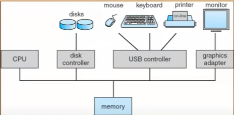

Created: 202502172138
Tags: 

## 1. Khái niệm hệ điều hành
### 1.1 Cấu trúc phân lớp của hệ thống
- Kiến trúc của 1 hệ thống máy tính
	
## 2. Lịch sử phát triển 
## 3. Các khái niệm 
## 4. Định nghĩa và phân loại 
## 5. Tính chất cơ bản 
## 6. Cấu trúc
## 7. Vấn đề xây dựng

-----
## References
1.
