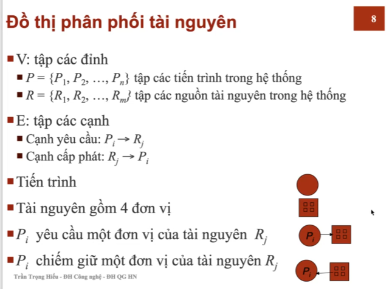

Created: 202505082152
Tags: 

## Bài toán bế tắc
Một tập hợp các tiến trình, trong đó mỗi tiến trình giữa 1 tài nguyên và đợi 1 tài nguyên đang bị chiếm giữ bởi 1 tiến trình khác trong tập hợp này

## Các điều kiện cần để có bế tắc
Bế tắc xảy ra khi 4 đk sau ĐỒNG THỜI diễn ra
- Loại trừ lẫn nhau: mỗi thời điểm, chỉ 1 tiến trình được sd tài nguyên
- Giữ và đợi: tiến trình chiếm giữ 1 tài nguyên và chờ 1 tài nguyên khác đang chiếm giữ bởi tiến trình khác
- Không dừng: tài nguyên chỉ được giải phóng bởi tiến trình chiếm giữ nó sau khi kết thúc nvu
- Chờ đợi vòng tròn: có 1 tập các tiến trình, trong đó P[i] đang đợi 1 tài nguyên bị chiếm bởi tiến trình ngay sau nó P[(i+1)%(n+1)]

## Đồ thị phân phối tài nguyên

## Các phương pháp xử lý bế tắc
#### Sử dụng các phương thức phòng hoặc tránh bế tắc nhằm đảm bảo hệ thống không bao
giờ vào trạng thái bế tắc
- C1: Loại bỏ 1 trong 4 đk cho phép bế tắc
	- Loại trừ lẫn nhau: cần thỏa mãn đối với tài nguyên KHÔNG cho phép chia sẻ
	- Giữ và chờ
		- Cho phép tiến trình yc 1 tài nguyên khi nó không chiếm giữ tài nguyên 
			nào cả
		- Hoặc yc các tiến trình thông báo các yc về tài nguyên và cấp phát tất cả
			các nguồn tài nguyên cho tiến trình trước thực thi
		- Nhược điểm: mức sd tài nguyên thấp và có thể xảy ra nạn đói
	- Không dừng
		- C1: 
			- Nếu tiến trình đang chiếm giữ 1 số tài nguyên và yc 1 tài nguyên khác mà nó không thể có ngay -> tất cả tài nguyên nó đang chiếm giữ được giải phóng
			- Các tài nguyên được giải phóng được thêm vào danh sách tài nguyên mà tiến trình đang chờ
		- C2:
			- Nếu các nguồn tài nguyên được yc bởi tiến trình P đang bị chiếm giữ bỏi Q và Q đang chờ 1 tài nguyên khác thì dừng Q lại, cấp phát tài nguyên được yc cho tiến trình P
			- Nếu các nguồn tài nguyên P cần không có sẵn hoặc khoong bị chiếm giữ bởi 1 tiến trình đang chờ khác, thì P phải chờ -> 1 số tài nguyên do P chiếm giữ sẽ được giải phóng nếu tiến trình khác yc
		- Tiến trình khởi động lại chỉ khi nó lấy được tất cả tài nguyên cũ và tài nguyên mới yc
	- Chờ đợi vòng tròn: đánh stt cho các tài nguyên, và môi tiến trình yc tài nguyên theo thứ tự tăng dần
- C2: Thêm thông tin về các yc tài nguyên
	- Yêu cầu mỗi tiến trình khai báo số lượng dơn vị tối đa mỗi loại tài nguyên mà nó cần
	- Sd thuật toán ktra trạng thái cấp phát tài nguyên để đảm bảo không có vòng tròn chờ đợi
	- Trạng thái cấp phát tài nguyên là số lượng tài nguyên có sẵn, số lượng tài nguyên đang sd và số lượng tài nguyên được yc bởi các tiến trình

#### Cho phép hệ thống vào trạng thái bế tắc, phát hiện và khôi phục lại

#### Bỏ qua và giả định rằng bế tắc không bao giờ xảy ra(hầu hết các HDH chọn cách thức này như linux, windows)

## Khôi phục khi bế tắc xảy ra

-----
## References
1.
